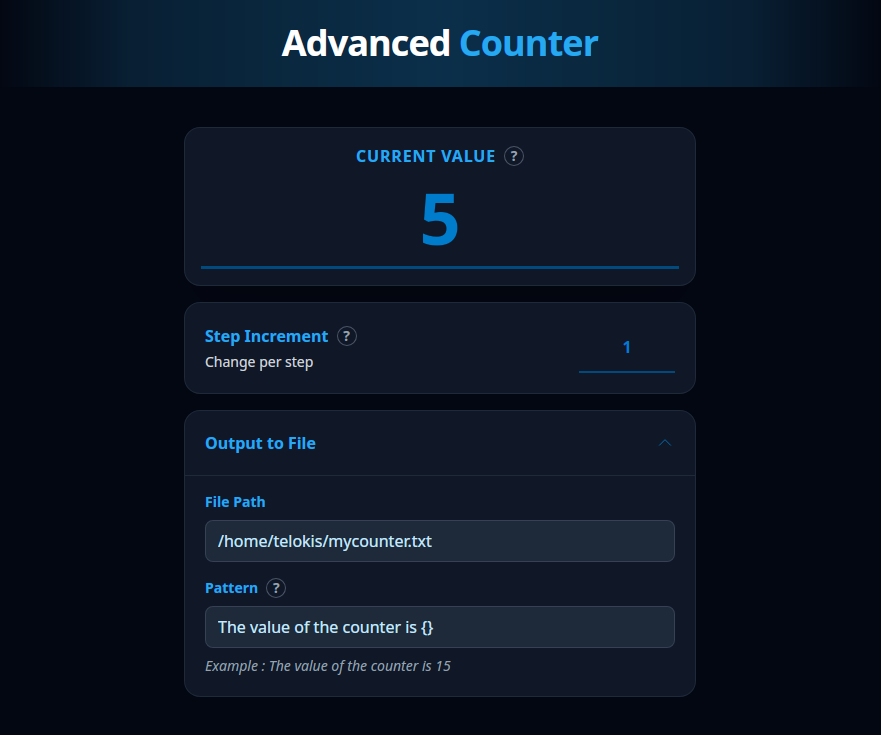
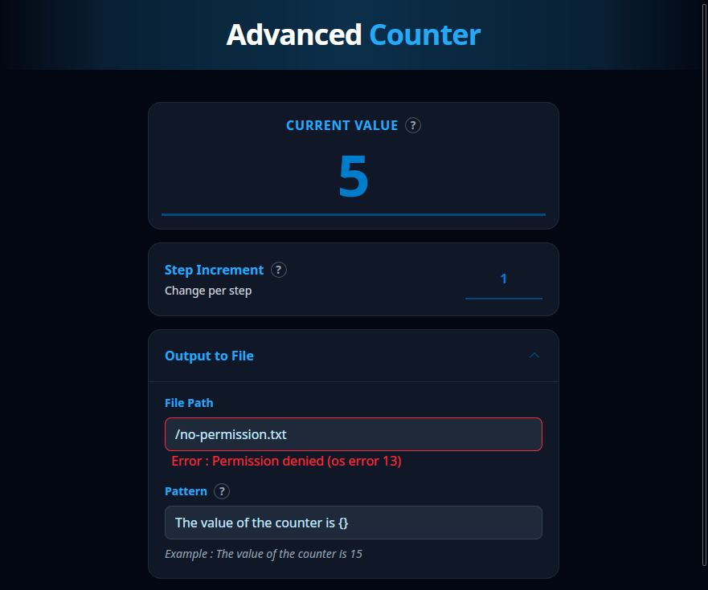

# Advanced Counter

<div align="center">
  

  A counter plugin for OpenAction that supports file output and customizable patterns.
</div>

## Features

- **Flexible Counter**: Increment or decrement with configurable step values
- **File Output**: Optionally write counter values to a file in real-time
- **Custom Patterns**: Use templates to format output (e.g., "Current count: {}")
- **Multi-Input Support**: Works with both buttons (Keypad) and dials (Encoder)
- **Direct Value Setting**: Manually set any counter value through the property inspector
- **Cross-Platform**: Supports Windows, macOS (Intel & Apple Silicon), and Linux (x86_64 & ARM64)
- **Error feedback**: Displays clear error messages when something unexpected happens but still keeps track of your counter!

## Installation

1. Download the latest release from the [Releases](../../releases) page
2. Extract the `com.telokis.advanced-counter.zip` file into your `plugins` folder
3. Add the `Advanced Counter` action to your profile

## Usage

### Configuration

After adding the plugin to your profile, you can acces its configuration interface.



#### Counter Settings

- **Current Value**: The current counter value (can be set directly)
- **Step Increment**: How much the counter changes per press/rotation (supports negative values)

#### File Output (Optional)

- **File Path**: Location where the counter value should be written (e.g., `/path/to/counter.txt`)
  - Make sure you have the appropriate permissions
  - Make sure the file or its parent directory exist
- **Pattern**: Template for output formatting
  - Use `{}` as a placeholder for the counter value
  - Example: `Counter: {}` will output `Counter: 15`
  - Leave empty to output just the number

### Controls

- **Button Press**: Increment by the step value
- **Dial Rotation**: Change counter by step × rotation amount
- **Dial Press**: Same as button press

### Errors when writing file

You may encounter errors if something is wrong with the specified file path.  
Common errors may include:
- **Path is nested (Most common)**: The action will not create directories, only the final file. Make sure the parent directory of your path already exists.
- **Permission error**: The action doesn't have permission to write at the specified path.
- **Path is a directory**: The action expects a file, if the path is a directory, there will be an error.

When an error occurs, you will notice an alert on your stream deck. Open the configuration interface to get more information.



## Development

### Prerequisites

- [Rust](https://rustup.rs/)
- [Node.js](https://nodejs.org/)

### Building from Source

1. Clone the repository:
```bash
git clone https://github.com/Telokis/openaction-advanced-counter.git
cd openaction-advanced-counter
```

2. Use the provided script to build the plugin and create a symlink in your [opendeck](https://github.com/nekename/OpenDeck/) folder:
```bash
./scripts/local_debug.sh
```

### Working on the property inspector

The property inspector uses the following main tech:
- [Vite](https://vite.dev/guide/) for bundling
- [Tailwind](https://tailwindcss.com/) for styling
- [preact](https://preactjs.com/) for the logic

You can use the following to setup a webserver rendering the property inspector in your browser:
```sh
cd property-inspector
npm run dev
```

This will benefit from hot module reloading but keep in mind there will be no interaction related to the StreamDeck available.

## Release process

Run the script `./scripts/release.sh <semver>` to do the following:
- Update the version number everywhere (`cargo.toml`, `package.json`, `manifest.json`)
- Commit the version change
- Create a git tag
- Push the commit and tag

When the tag is pushed, it triggers the github workflow that will take care of:
- Building the Rust part of the plugin for all supported systems.
- Building the property inspector frontend.
- Bundle everything into a single zip with the appropriate structure.
- Create a github release with the zip attached to it.

## License

See the repository for license information.
